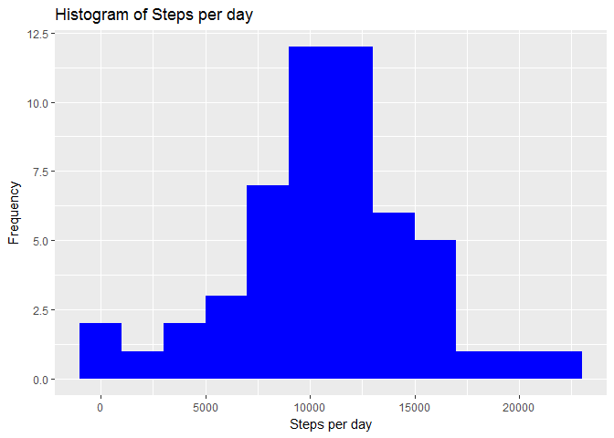

Calling required libraries/R packages

    library(dplyr)
    library(knitr)
    library(lubridate)
    library(ggplot2)
    library(lattice)
    library(markdown)

### Part1: Loading and processing the data

    setwd("C:/coursera_project/cr5wk2/FINAL")
    data <- read.csv("activity.csv", header =TRUE,sep = ',', colClasses =c("numeric","character","integer"))
    data$date <- ymd(data$date) #using lubridate package

----------------------------------------------------------------------------------------------------------
----------------------------------------------------------------------------------------------------------

### Part2: What is mean total number of steps taken per day?

Histogram of the total number of steps taken each day (excluding 'NA'
values)

    steps <- data %>%filter(!is.na(steps)) %>%group_by(date) %>%summarize(steps=sum(steps)) %>%print

    ## # A tibble: 53 x 2
    ##          date steps
    ##        <date> <dbl>
    ##  1 2012-10-02   126
    ##  2 2012-10-03 11352
    ##  3 2012-10-04 12116
    ##  4 2012-10-05 13294
    ##  5 2012-10-06 15420
    ##  6 2012-10-07 11015
    ##  7 2012-10-09 12811
    ##  8 2012-10-10  9900
    ##  9 2012-10-11 10304
    ## 10 2012-10-12 17382
    ## # ... with 43 more rows

Including Plots

Mean and median number of steps taken each day

    mean(steps$steps)

    ## [1] 10766.19

    median(steps$steps)

    ## [1] 10765

--------------------------------------------------------------------------------------------------------
--------------------------------------------------------------------------------------------------------

### Part3: What is the average daily activity pattern?

Time series plot of the average number of steps taken  
Compute the means of steps accross all days for each interval

The 5-minute interval that, on average, contains the maximum number of
steps

    max_index <- which(mean_interval$mean == max(mean_interval$mean))
    max_interval <- mean_interval[max_index, 1]

max\_interval value is 835

------------------------------------------------------------------------------------------------------------
------------------------------------------------------------------------------------------------------------

### Part4: Imputing missing values

Code to describe and show a strategy for imputing missing data,
Histogram

    #Reading fresh data
    setwd("C:/coursera_project/cr5wk2/FINAL")
    data <- read.csv("activity.csv", header =TRUE,sep = ',', colClasses = c("numeric","character","integer"))
    data$date <- ymd(data$date)
    NA_count <- sum(is.na(data$steps))
    # NA count is 2304
    na_index <- which(is.na(data$steps))

    #keeping very simple, replacing NA by avergae step and put it in one dim array/vector
    simple_mean_to_update_NA <- rep(mean(data$steps, na.rm=TRUE), times=NA_count)
    #Update dataset with missing values
    data[na_index, "steps"] <- simple_mean_to_update_NA
    head(data)

    ##     steps       date interval
    ## 1 37.3826 2012-10-01        0
    ## 2 37.3826 2012-10-01        5
    ## 3 37.3826 2012-10-01       10
    ## 4 37.3826 2012-10-01       15
    ## 5 37.3826 2012-10-01       20
    ## 6 37.3826 2012-10-01       25

Histogram of the total number of steps taken each day (with replaced
'NA' values)

    steps <- data %>%filter(!is.na(steps)) %>%group_by(date) %>%summarize(steps = sum(steps)) %>%print

    ## # A tibble: 61 x 2
    ##          date    steps
    ##        <date>    <dbl>
    ##  1 2012-10-01 10766.19
    ##  2 2012-10-02   126.00
    ##  3 2012-10-03 11352.00
    ##  4 2012-10-04 12116.00
    ##  5 2012-10-05 13294.00
    ##  6 2012-10-06 15420.00
    ##  7 2012-10-07 11015.00
    ##  8 2012-10-08 10766.19
    ##  9 2012-10-09 12811.00
    ## 10 2012-10-10  9900.00
    ## # ... with 51 more rows

    ggplot(steps, aes(x = steps)) +
      geom_histogram(fill = "blue", binwidth = 2000) +
      labs(title = "Histogram of Steps per day", x = "Steps per day", y = "Frequency")

mean and median total number of steps taken per day

    mean(steps$steps)

    ## [1] 10766.19

    median(steps$steps)

    ## [1] 10766.19

The mean has not differed from the estimates from the first part of the
assignment. The median differed a bit. the impact of imputing missing
data on the estimates of the total daily number of steps is low

-------------------------------------------------------------------------------------------------------------
-------------------------------------------------------------------------------------------------------------

Part-5: Are there differences in activity patterns between weekdays and weekends?
---------------------------------------------------------------------------------

Using the updated dataset with the filled-in missing values find
weekdays from the date attribute

    updated_dataset <- data.frame(date=data$date, weekday=tolower(weekdays(data$date)), steps=data$steps, interval=data$interval)
    # Compute new factor variable 'daytype' (two levels - weekend,weekday) and add this new column using cbind
    updated_dataset <- cbind(updated_dataset, daytype=ifelse(updated_dataset$weekday == "saturday" | updated_dataset$weekday == "sunday", "weekend","weekday"))
    head(updated_dataset)

    ##         date weekday   steps interval daytype
    ## 1 2012-10-01  monday 37.3826        0 weekday
    ## 2 2012-10-01  monday 37.3826        5 weekday
    ## 3 2012-10-01  monday 37.3826       10 weekday
    ## 4 2012-10-01  monday 37.3826       15 weekday
    ## 5 2012-10-01  monday 37.3826       20 weekday
    ## 6 2012-10-01  monday 37.3826       25 weekday

    # Create the final data frame
    final_dataset <- data.frame(date=updated_dataset$date, weekday=updated_dataset$weekday, daytype=updated_dataset$daytype, 
                           interval=updated_dataset$interval,
                           steps=data$steps)

    # Compute the average number of steps taken, averaged across all daytype variable
    second_mean_data <- aggregate(final_dataset$steps, 
                           by=list(final_dataset$daytype, 
                                   final_dataset$weekday, final_dataset$interval), mean)

    # Rename the attributes
    names(second_mean_data) <- c("daytype", "weekday", "interval", "mean")
    head(second_mean_data)

    ##   daytype  weekday interval     mean
    ## 1 weekday   friday        0 8.307244
    ## 2 weekday   monday        0 9.418355
    ## 3 weekend saturday        0 4.672825
    ## 4 weekend   sunday        0 4.672825
    ## 5 weekday thursday        0 9.375844
    ## 6 weekday  tuesday        0 0.000000

    # Compute the time serie plot
    xyplot(mean ~ interval | daytype, second_mean_data, type="l",lwd=1,xlab="Interval",ylab="Number of steps",layout=c(1,2))

